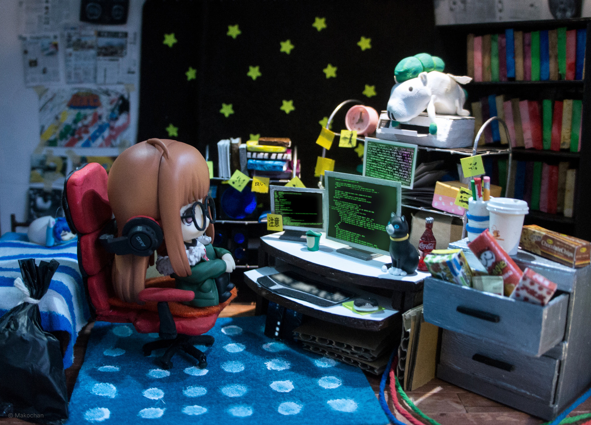

    

 

<h2>About Me</h2>
   I am an aspiring Data Engineer based in Charlotte, NC. I have a Biomedical Science and Engineering background from my prior academic contributions. Currently, I am focused on completing my B.A. in Computing & Data Analytics with a concentration in Business.
    

     
  
   
   - I love staying up-to-date with the latest technology and building PCs
 - Besides gaming and tech, I enjoy painting and drawing

<h2 align="center">🌱 Github Stats 🌱</h2>
<table align="center">
  <tr border="none">
    <td width="50%" align="center" style="text-align: center;">
      

        
      

       
       
    </td>
  </tr>
</table>
